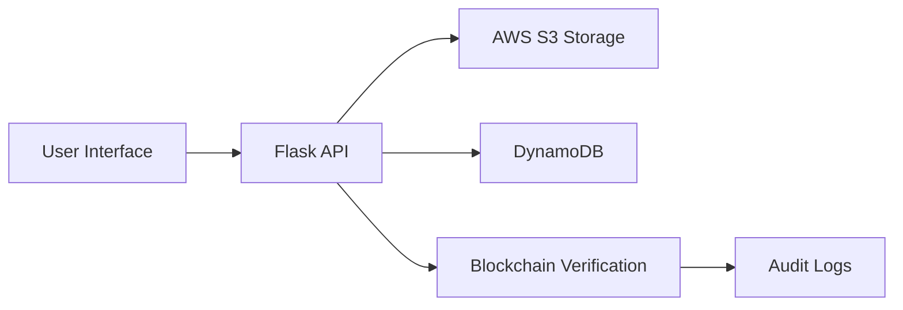

# 📄 Next-Gen Document Management System

<p align="center">
  
</p>

<p align="center">
  <a href="#features">Features</a> •
  <a href="#demo">Demo</a> •
  <a href="#technologies">Technologies</a> •
  <a href="#architecture">Architecture</a> •
  <a href="#installation">Installation</a> •
  <a href="#project-structure">Project Structure</a> •
  <a href="#usage">Usage</a> •
  <a href="#contributing">Contributing</a>
</p>

---

## 📋 Introduction

**DocManager** is a state-of-the-art, cloud-based document management system designed to securely store, search, and verify documents with unmatched efficiency. Built with Flask and AWS, it leverages advanced security features like AES encryption and blockchain-inspired verification to ensure data integrity and transparency.

Featuring a sleek, responsive interface optimized for both desktop and mobile devices, DocManager makes document management intuitive and accessible from anywhere.

## ✨ Features

- 🔐 **Robust Security**: AES encryption and secure user authentication for comprehensive data protection
- 📤 **Seamless Document Operations**: Upload, view, edit, download, and delete documents effortlessly
- 🔍 **Advanced Search**: Aho-Corasick algorithm for rapid keyword searches across documents
- ⚡ **Efficient Filtering**: Bloom Filters for quick rejection of irrelevant search queries
- 🌳 **Data Integrity**: Merkle Root verification for tamper-proof document assurance
- ⛓️ **Transparent Auditing**: Immutable logs inspired by blockchain technology for full traceability
- 📱 **Responsive Design**: Optimized user experience for both desktop and mobile platforms
- 📊 **Analytics Dashboard**: Comprehensive visualization of storage usage and document metrics

## 🎬 Demo

Experience DocManager in action! Our comprehensive demo showcases the complete workflow:

**Upload ➡️ Encrypt ➡️ Search ➡️ Verify ➡️ Log**

🎥 [**Watch the Full Demo on Google Drive**](https://drive.google.com/file/d/1giTkAmWYzmX4qj2xtrcRhWkZP8Y9jKSr/view?usp=sharing)

## 🛠️ Technologies

### Backend Technologies
-  **Flask**: Lightweight and flexible web framework
-  **AWS Services**:
  - **S3**: Scalable and secure document storage
  - **DynamoDB**: High-performance NoSQL database for metadata
-  **Solidity & Ganache**: Blockchain-based verification and audit logging
-  **Advanced Algorithms**: Encryption, search optimization, Bloom Filters, and Merkle Trees

### Frontend Technologies
-  **HTML5**: Semantic and structured content
-  **CSS3**: Modern styling and animations
-  **JavaScript**: Dynamic functionality and user interactions
-  **Bootstrap**: Responsive and mobile-first design framework

### Development & Testing Tools
-  **Git**: Version control and collaboration
-  **Selenium**: Automated end-to-end testing
-  **PyTest**: Comprehensive unit and integration testing

## 📐 Architecture

DocManager employs a robust, modular architecture designed for scalability and reliability:



**Architecture Components:**
- **Frontend Layer**: Responsive Bootstrap-powered interface for seamless user interactions
- **API Layer**: Flask routes handling document operations, encryption, and search functionality
- **Storage Layer**: AWS S3 for secure file storage and DynamoDB for efficient metadata management
- **Verification Layer**: Solidity smart contracts and Ganache for tamper-proof audit logging

## 🚀 Installation

### Prerequisites
- Python 3.8 or higher
- Node.js (for Ganache)
- AWS Account with S3 and DynamoDB access
- Git

### Setup Instructions

1. **Clone the Repository**
   ```bash
   git clone https://github.com/Prathmesh-S27/Next-Gen-Document-Management-System.git
   cd Next-Gen-Document-Management-System
   ```

2. **Create Virtual Environment**
   ```bash
   python -m venv venv
   
   # On Windows
   venv\Scripts\activate
   
   # On macOS/Linux
   source venv/bin/activate
   ```

3. **Install Dependencies**
   ```bash
   pip install -r Backend/requirements.txt
   ```

4. **Configure Environment Variables**
   ```bash
   # Copy example environment file
   cp Backend/.env.example Backend/.env
   
   # Edit Backend/.env with your AWS credentials and configuration
   ```

5. **Setup AWS Services**
   - Configure AWS credentials for S3 and DynamoDB access
   - Ensure proper IAM permissions for the required services

6. **Initialize Blockchain Environment**
   ```bash
   # Install and start Ganache
   npm install -g ganache-cli
   ganache-cli
   
   # In a new terminal, setup blockchain
   python Backend/setup_blockchain.py
   ```

7. **Initialize Database**
   ```bash
   python Backend/init_db.py
   ```

8. **Launch the Application**
   ```bash
   python Backend/app.py
   ```

9. **Access the Application**
   Open your browser and navigate to: `http://localhost:5000`

## 📂 Project Structure

```
Next-Gen-Document-Management-System/
├── 📁 Backend/
│   ├── 📁 blockchain/              # Solidity contracts & blockchain setup
│   ├── 📁 reports/                # Test coverage & performance reports
│   ├── 📁 routes/                 # Flask API route handlers
│   ├── 📁 tests/                  # Unit & integration test suites
│   ├── 📁 utils/                  # Utility modules (encryption, search, etc.)
│   ├── 📄 app.py                  # Main Flask application entry point
│   ├── 📄 requirements.txt        # Python dependencies
│   ├── 📄 .env.example           # Environment variables template
│   └── 📄 init_db.py             # Database initialization script
├── 📁 Frontend/
│   ├── 📁 static/                 # CSS, JavaScript, and image assets
│   └── 📁 templates/              # Jinja2 HTML templates
├── 📁 demo/                       # Demonstration scripts and samples
│   ├── 📄 auto_demo.py           # Automated demo workflow
│   ├── 📄 full_end_to_end_demo.py # Complete system demonstration
│   └── 📄 demo_document.txt       # Sample documents for testing
└── 📄 README.md                   # Project documentation (this file)
```

## 💻 Usage

### Basic Operations

1. **User Registration/Login**: Create an account or log in to access the system
2. **Document Upload**: Securely upload documents with automatic encryption
3. **Search & Filter**: Use advanced search algorithms to find documents quickly
4. **Document Management**: View, edit, download, or delete documents as needed
5. **Verification**: Verify document integrity using blockchain-based checksums
6. **Analytics**: Monitor usage patterns and storage metrics through the dashboard

### API Endpoints

The system provides RESTful API endpoints for programmatic access:

- `POST /api/upload` - Upload new documents
- `GET /api/documents` - Retrieve document listings
- `GET /api/search` - Search documents by keywords
- `GET /api/verify/{document_id}` - Verify document integrity
- `DELETE /api/documents/{document_id}` - Delete documents

## 🧪 Testing

Run the comprehensive test suite:

```bash
# Run all tests
python Backend/run_tests.py

# Run specific test categories
pytest Backend/tests/unit/
pytest Backend/tests/integration/

# Generate coverage report
pytest --cov=Backend --cov-report=html
```

## 🤝 Contributing

We welcome contributions! Please follow these steps:

1. Fork the repository
2. Create a feature branch (`git checkout -b feature/amazing-feature`)
3. Commit your changes (`git commit -m 'Add amazing feature'`)
4. Push to the branch (`git push origin feature/amazing-feature`)
5. Open a Pull Request

## 📄 License

This project is licensed under the MIT License. See the [LICENSE](LICENSE) file for details.

## 📞 Support

For support, please reach out to:
- **Email**: Prathmesh.2730@gmail.com

---

<p align="center">
  Made with ❤️ by the DocManager Team
</p>